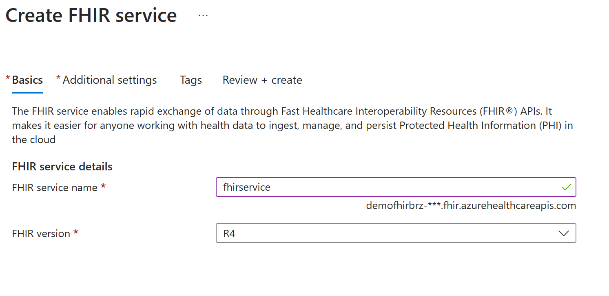

# Como configurar um serviço FHIR para os primeiros acessos

1. Crie uma conta de serviço no Azure Active Directory. 
* Abra o Portal Azure (https://azure.portal.com), acesse _Azure Active Directory_.

* Abra a seção "Enterprise applications" e clique em "New Application".

* Clique em "Create your own application".

* Forneça um nome para a conta de serviço sendo criada e selecione a opção "_Register an application to integrate with Azure AD (App you're developing)_". Clique em "Create".

* Na página seguinte, mantenha selecionado "_Accounts in this organizational directory only_" e clique em "Register"

2. Crie uma senha (_secret_) para a conta recentemente criada.
* Na barra de busca do Portal Azure, digite o nome da conta de serviço recentemente criada. Selecione o resultado listado como "_Application_".

* **Detalhe importante:** ao abrir a conta de serviço, será listada uma propriedade chamada "_Application (client) ID_" e outra chamada "_Directory (tenant) ID_". "_Application (client) ID_" corresponde ao identificador da aplicação (_appId_) dentro do Azure Active Directory. Enquanto que o "_Directory (tenant) ID_"  (_tenantId_) corresponde ao identificador global do Azure Active Directory. Ambos valores serão utilizados em nossos exemplos para a criação de um token de autenticação que permitirá o acesso.

* Clique em "_Certificates & Secrets_".

* Selecione "_New client secret_" para criar uma nova senha para a conta de serviço. Forneça uma descrição e uma data de expiração para a senha. Clique em "_Add_".

* Copie nesse momento a senha criada e salve-a em um lugar seguro. Essa senha será utilizada em nossos exemplos de uso.

3. Crie uma serviço FHIR.
* Crie um "_Resource Group_" na região mais próxima. 

* Dentro do "_Resource Group_" recentemente criado, crie em "Create" e busque por "_Azure Health Data Services_". Selecione "_Azure Health Data Services_". Clique em "_Create_".

* Forneça uma nome para a área de trabalho (_workspace_) e clique em "_Review + Create_". Na próxima página clique em "_Create_". **Detalhe importante:** a nova geração do FHIR não está disponível no Brasil, por isso, sugiro a criação da _workspace_ em _South Central US_.

* Depois da criação da _workspace_, crie um novo serviço FHIR. Clique em "_FHIR Service_" e depois clique em "_Add FHIR Service_".

* Define um nome para o serviço FHIR e clique em "_Review + Create_". Na próxima página clique em "_Create_". Aguarde o fim do provisionamento do serviço.

* Ao término do provisionamento seu serviço estará pronto para ser utilizado. 

4. Atributa permissões de acesso para o seu serviço.

* Com o novo serviço FHIR criado, clique em "_Access control (IAM)_".

* Agora clique em "_Add Role Assignment_".

 

* Selecione a _role_ "_FHIR Data Contributor_" em clique em "Next"

* Na nova página, selecione "User, group, or service principal". Clique em "Select Members" e busque pela conta de serviço criada nos passos anteriores. Clique em "_Review + assign_". A nova permissão de acesso será atribuída.

Ao fim destes passos a conta de serviço criada já terá permissões de acesso ao novo serviço FHIR. Lembre-se de copiar o _tenant id_ do Active Directory, _app id_ da conta de serviço e sua senha (_secret_). Esses valores são importantes para execução dos exemplos.